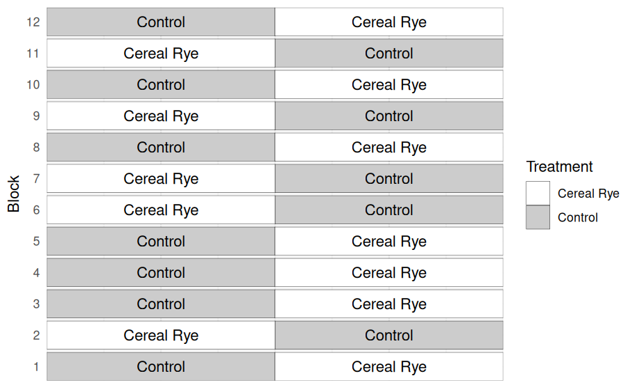

# Introduction

The goal of this assignment is to give you
hands-on practice conducting paired $t$-tests,
interpreting confidence intervals, and thinking
carefully about how data structure affects
analysis.

In this assignment, you will analyze data from a
strip-trial evaluating whether a cereal rye cover
crop reduces corn yield. Corn was planted
following either:

- No cover crop (Control)
- Cereal rye terminated prior to planting.

Strips were paired within blocks across the field
to control for spatial variability. Your task is
to determine whether the rye treatment affected
corn yield.

You can see an example of the trial design.



Submit a knitted PDF/HTML generated from your R
Markdown file to Canvas.

# Question 1  

**1 point**  

Load the dataset "data/cover-crop.csv"
and assign it to an object called rye.

Inspect the first six rows using head().

```{r}
library(ggplot2)
rye <- read.csv('./data/cover-crop.csv')
head(rye)
```

# Question 2

**2 points**

Before analyzing the data, let's visualize it. Build a plot in which you show the yield observations of both treatments. This next part is optional but, how about adding the mean for each treatment and the standard deviation?

hint: there's a graph like this in the lecture HTML. Also, pay attention to the column names. Capitalization matters in R. 

```{r}
ggplot(rye)+
  geom_point(aes(x = Yield, y = Treatment), pch = 1)+
  labs(x = 'Yield (bu/ac)', y = 'Treatment')+
  stat_summary(aes(x = Yield, y = Treatment),
               pch = 17,
               fun.data = 'mean_se')+
  theme_bw()
```

# Question 3

**3 points**

Because this is a paired design, we will analyze
the difference within each block.

1. Reshape the dataset into wide format so that
each treatment has its own column.

2. Compute a new column called diff
representing: Control yield-Rye yield

```{r}
rye_wide <- reshape(rye,
                    idvar = 'Block',
                    timevar = 'Treatment',
                    direction = 'wide')
rye_wide

rye_wide$diff <- rye_wide$Yield.Control - rye_wide$`Yield.Cereal Rye`
rye_wide
```


# Question 4

**3 points**

Using the vector of differences:
1. Compute the mean difference
2. Compute the standard error
3. Compute the t-value that we can use to construct
a 95% confidence interval

```{r}
xbar <- mean(rye_wide$diff)
s <- sd(rye_wide$diff) / sqrt(length(rye_wide$diff))
t.val <- qt(c(0.025, 0.975), nrow(rye_wide) - 1)

xbar
s
t.val
```


# Question 5

**1 point**

Construct a 95% confidence interval

```{r}
ci <- xbar + (s * t.val)
ci
```

# Question 6

**2 points**

Interpret your confidence interval. Does the
interval include zero? What does this tell us
about whether cereal rye reduces corn yield?


# Question 7

**2 points**

Use the built-in t.test() function in R to
conduct a paired $t$-test comparing rye and
control treatments. 

Report:
1. The $t$-statistic
2. The p-value
3. The 95% confidence interval

```{r}
t.test(rye_wide$Yield.Control,
       rye_wide$`Yield.Cereal Rye`,
       paired = TRUE)
```


# Question 8

**1 point**

Write a brief interpretation of the $t$-test
output. Things worth mentioning are the hypothesis
you tested, the p-value, and whether you reject
the null hypothesis.


