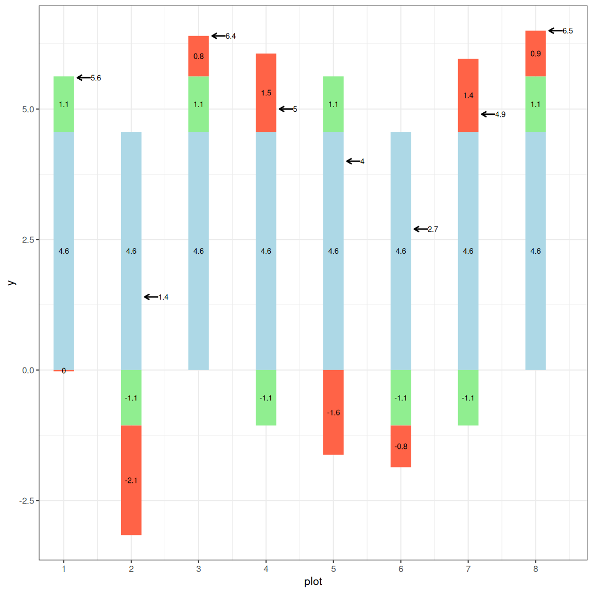

# Introduction

The goal of this assignment is to help you connect
the linear additive model to hypothesis testing,
Type I and Type II errors, and one-sided tests.

In this module, we moved beyond formulas and
looked at what a statistical test is actually
doing underneath the surface. We explored the
linear additive model:

$$Y_{ij} = \mu + \tau_i + \epsilon_{ij}$$ 


and discussed how treatment effects and random
error combine to produce the observed value.

In this assignment, I ask you to interpret model
components, think carefully about decision-making
under uncertainty, and conduct a one-sided
$t$-test.

Submit a knitted PDF/HTML generated from your R
Markdown file to Canvas.


The image below represents the strawberry dataset
in a stacked bar plot showing the population mean,
treatment effect, and error effect for each plot.




**note: ** When I ask for models and hypotheses, you
don't have to spend much time trying to figure out
how to write mathematical symbols in R. You can
write things in plain text, as long as I can
understand what you meant.

You can use the `strawberry` dataset, which already contains the 
computed effects.

```{r}
strawberry <- read.csv('./data/strawberry_effects_table.csv')
strawberry
```

# Question 1

**2 points**

Given the graph above, write the linear model for
the observed value in plot 3, as we did in the
exercise.


# Question 2

**2 points**

Given the plot above, write the linear model for
the observed value in plot 5, as we did in the
exercise.


# Question 3

**2 points**

You are testing a new fungicide to control
Northern Corn Leaf Blight.  Given it also has the
potential to improve plant health under heat and
drought situations, you plan to charge a price of
$20 per acre.  If there is no improvement with the
fungicide, the farmer will lose  $20 per acre.
Given this high price, would you be more concerned
with a Type I or Type II error.  Why?


# Question 4

**2 points**

You are a sales agronomist with a grower who
counts on you to bring them the latest, greatest
opportunities to enhance yield.  Their FOMO is
pronounced. You are running a t-test on
side-by-side data from a distributor, for a
product which would cost $3 per acre but has the
potential to increase corn yield up to 4 bushels.
Given the lower product cost and potentially high
return on investment, as well as your concerns
your customer would be upset at missing an
opportunity to boost yield, are you more concerned
about a Type I or Type II error in your analysis.
Why?


# Question 5

**2 points**

You are testing a new in-furrow fertilizer. It
will cost more to produce, hence you will need to
charge a greater market price. Thus, you will
only release it if it produces significantly
greater yield than your existing in-furrow
product.  You cannot afford to release a new
product that does not work.  Would you run a
one-tailed or two-tailed test on your data?


# Question 6

**2 points**

What would your null and alternative hypotheses be
for the test in `Question 5`?


# Question 7

**3 points**

Read in the dataset "data/wheat.csv". The data set
contains a column called "nitro" contains values
"L" or "H", meaning lower and higher nitrogen
fertilization levels.

Conduct a one-tailed $t$-test where the high
nitrogen (nitro="H") treatment yields `greater` than
the low nitrogen treatment.

```{r}

```

