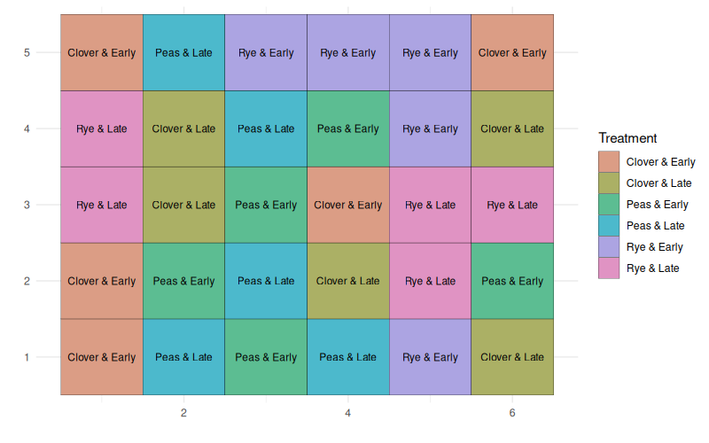
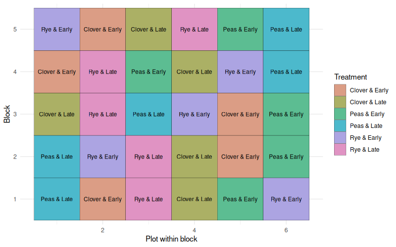
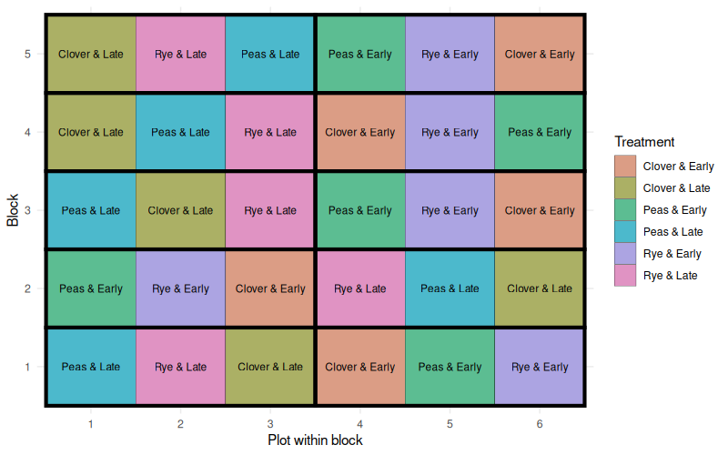

# Exercise: Completely Randomized Factorial Trial ----

A research team is interested in understanding how
different cover crop species influence corn yield.
In addition, they suspect that the timing of cover
crop termination might affect how much nitrogen
and water remain available for the following corn
crop.

The researchers therefore designed a study
evaluating:

  Factor 1: Cover crop species
  Factor 2: Termination timing

Termination timing has two levels:
  - 15 days before corn planting
  - 1 day before corn planting

The response variable measured at the end of the
season is corn yield (bushels per acre).


The study was conducted at a small experimental
site that was known to be relatively uniform in
soil properties, slope, and previous management.

Because there were no obvious gradients or field
variability patterns, the researchers decided that
blocking was unnecessary. Instead, they randomly
assigned all treatment combinations across the
available plots.



This resulted in a completely randomized factorial
experiment.

Loading the dataset

```{r}
crd <- read.csv('./data/cover-crop-and-termination-crd.csv')
```


This figure shows the individual observations for each treatment
combination, along with the mean and its standard error.

```{r}
library(ggplot2)

ggplot(crd,
       aes(x = paste(species, termination, sep = " & "),
           y = yield)) +
  geom_point(pch = 21, size = 2) +
  stat_summary(fun.data = mean_se,
               geom = "errorbar",
               width = 0.2) +
  stat_summary(fun = mean,
               geom = "point",
               shape = 17,
               size = 3) +
  coord_flip() +
  theme_linedraw() +
  labs(x = "Species & Termination",
       y = "Corn Yield (bu/ac)")

```


Before fitting the model, it is useful to write
the statistical model.

The factorial model can be written as:

$$
Y_{ijk} = \mu + S_i + T_j + ST_{ij} + \varepsilon_{ijk}
$$

where:  
$\mu$ = overall mean  
$S_i$ = effect of cover crop species  
$T_j$ = effect of termination timing  
$ST_{ij}$ = interaction between species and termination  
$\varepsilon_{ijk}$ = random error


```{r}
model_crd <- lm(yield ~ species * termination,
                data = crd)

anova(model_crd)
```


If the interaction term (species:termination) is
statistically significant, it suggests that the
effect of cover crop species changes depending on
when the cover crop is terminated.

If the interaction is not significant, the main
effects of species and termination can be
interpreted independently.


# Exercise: Randomized Complete Block Design ----


After running the first experiment, the research
team decided to repeat the study at a larger
research farm. However, when visiting the site,
they noticed that the field had a clear
productivity gradient running from one end of the
field to the other.

The lower part of the field tends to remain wetter
during the spring, while the upper part drains
more quickly. Because soil moisture can influence
both cover crop growth and corn yield, the
researchers were concerned that this environmental
variability could obscure treatment effects.

To account for this variability, they divided the
field into blocks. Each block contains plots that
are relatively similar to each other, while
differences between blocks capture the broader
soil gradient.

By grouping similar experimental units into
blocks, the researchers can account for systematic
environmental variability across the field.

Within each block, all treatment combinations are
present exactly once. Treatments are randomized
within block, ensuring that treatment comparisons
occur under similar environmental conditions.


This design allows the analysis to separate
variability due to:

  - treatment effects
  - block-to-block environmental differences
  - unexplained random variation
  
  

  
Loading the data

```{r}
rcbd <- read.csv('./data/cover-crop-and-termination-rcbd.csv')
```

As before, open circles represent individual
observations, while triangles and error bars
represent treatment means and their standard
errors.

```{r}
ggplot(rcbd,
       aes(x = paste(species, termination, sep = " & "),
           y = yield)) +
  geom_point(pch = 21, size = 2) +
  stat_summary(fun.data = mean_se,
               geom = "errorbar",
               width = 0.2) +
  stat_summary(fun = mean,
               geom = "point",
               shape = 17,
               size = 3) +
  coord_flip() +
  theme_linedraw() +
  labs(x = "Species & Termination",
       y = "Corn Yield (bu/ac)")
```


Because the experiment now includes blocks, the
statistical model includes an additional term
representing block-to-block variability.

The additive model can be written as:

$$
Y_{ijkl} = \mu + B_l + S_i + T_j + ST_{ij} + \varepsilon_{ijkl}
$$

where:  
$\mu$ = overall mean  
$B_l$ = block effect  
$S_i$ = effect of cover crop species  
$T_j$ = effect of termination timing  
$ST_{ij}$ = interaction between species and termination  
$\varepsilon_{ijkl}$ = random error

In this model, block accounts for pre-existing environmental
variability across the field.


```{r}
model_rcbd <- lm(yield ~ block + species + termination + species:termination,
                 data = rcbd)

anova(model_rcbd)
```

In this model, block is treated as a fixed effect.
This allows us to remove the variability
associated with blocks before evaluating the
treatment effects.

In many agricultural experiments, blocks are
better viewed as a random sample of environmental
conditions rather than factors of direct
scientific interest. In that case, we can model
block as a random effect.

```{r}
library(nlme)

model_rcbd_mixed <- lme(yield ~ species * termination,
                        random = ~1 | block,
                        data = rcbd)

anova(model_rcbd_mixed)
VarCorr(model_rcbd_mixed)
```


The difference from the previous exercise is that
variability due to environmental gradients is now
captured by the block term. By removing this
systematic variability from the residual error,
the analysis can more clearly detect treatment
effects.


# Exercise: Split-Plot Design ----

In the previous experiment, the research team
evaluated the effects of cover crop species and
termination timing on corn yield. The trial was
conducted as a randomized complete block design,
where all treatment combinations were randomized
within each block.

When planning the next trial, however, the
researchers realized that termination timing was
much harder to apply than the cover crop species.
Changing the termination date requires scheduling
equipment passes and coordinating field operations
across multiple plots.

Because of these logistical constraints, the
researchers decided to terminate entire strips of
the field at the same time. Some strips were
terminated early (15 days before planting corn),
while others were terminated late (1 day before
planting).

Within each of these strips, the three cover crop
species were then planted in smaller subplots.




This creates a split-plot structure.

Loading the dataset

```{r}
splitplot <- read.csv('./data/cover-crop-and-termination-split.csv')
```

The difficult-to-apply treatment (termination
timing) becomes the
*main-plot factor*, applied to larger experimental units.

The easier treatment (cover crop species) becomes
the *subplot factor*, randomized within each main
plot.

This design reflects how many real agricultural
experiments must be conducted in practice: some
treatments simply cannot be randomized at the
smallest possible scale.


As in the previous exercises, circles represent
individual observations, while triangles and error
bars show treatment means and standard errors.

```{r}
ggplot(splitplot,
       aes(x = paste(species, termination, sep = " & "),
           y = yield)) +
  geom_point(pch = 21, size = 2) +
  stat_summary(fun.data = mean_se,
               geom = "errorbar",
               width = 0.2) +
  stat_summary(fun = mean,
               geom = "point",
               shape = 17,
               size = 3) +
  coord_flip() +
  theme_linedraw() +
  labs(x = "Species & Termination",
       y = "Corn Yield (bu/ac)")

```


Split-plot experiments introduce an additional
layer of variability.

Observations within the same main plot tend to be
more similar to each other than to observations in
different main plots. This creates a second source
of random variation in the model.

The additive model for this experiment can be
written as:

$$
Y_{ijkl} = \mu + S_i + T_j + ST_{ij} + b_k + m_{jk} + \varepsilon_{ijkl}
$$

where:  
$\mu$ = overall mean  
$S_i$ = effect of cover crop species  
$T_j$ = effect of termination timing  
$ST_{ij}$ = interaction between species and termination  
$b_k$ = random block effect  
$m_{jk}$ = random main-plot effect (termination within block)  
$\varepsilon_{ijkl}$ = subplot error

To account for the hierarchical structure of the
experiment, we use a mixed model that includes two
random effects:

  - block
  - main plots nested within block

```{r}
library(nlme)

model_split <- lme(
  yield ~ species + termination + species:termination,
  random = ~1 | block/termination,
  data = splitplot
)


anova(model_split)

```


The important difference from the previous design
is that this model accounts for two levels of
random variability:

  - variability among blocks
  - variability among main plots within blocks

Ignoring this hierarchical structure would
underestimate the true variability in the
experiment and could lead to misleading
conclusions.
