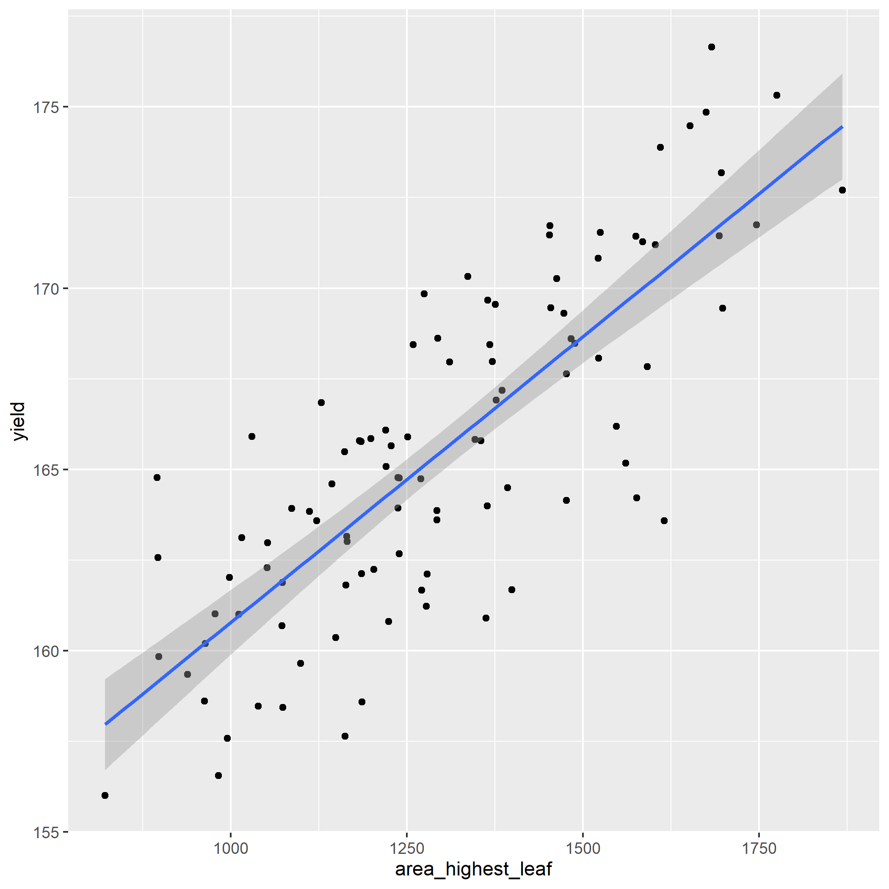
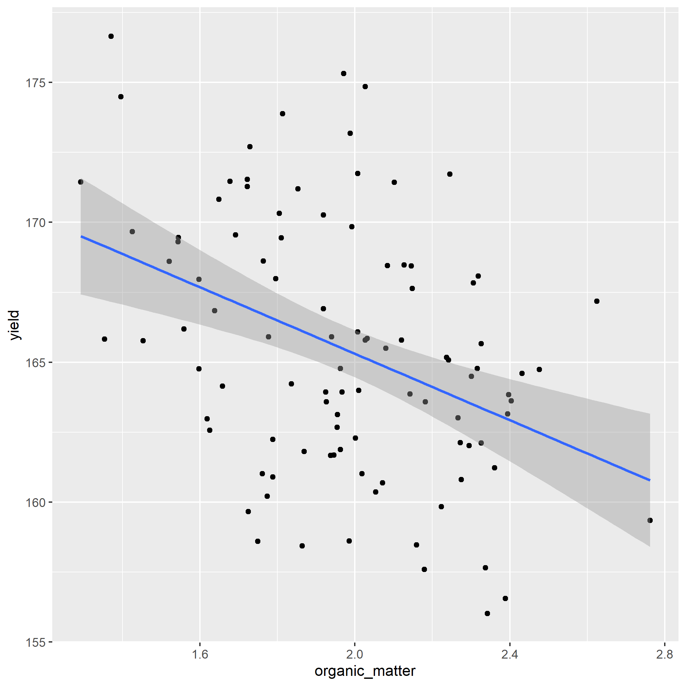

# Introduction

After fitting a regression model, we often want to:

- visualize the fitted relationship
- make predictions for new values of `X`
- interpret prediction limits responsibly

# Case Study: Corn Allometry

```{r}
library(tidyverse)
allometry = read.csv("data/corn_allometry.csv")
head(allometry)
```

## Fit and Evaluate the Model

```{r}
model_circumference = lm(yield ~ stalk_circ, data=allometry)
```

```{r}
library(broom)
tidy(model_circumference)
```

```{r}
glance(model_circumference)
```

## Visualize the Regression Line

```{r}
allometry %>%
  ggplot(aes(x=stalk_circ, y=yield)) +
  geom_point() +
  geom_smooth(method = "lm", se=TRUE)
```

## Create New Data and Predict

```{r}
new_stalk_data = data.frame(
  stalk_circ=c(1.5,
               2.0,
               2.5,
               3.0,
               3.5))

new_stalk_data
```

```{r}
predict(model_circumference, new_stalk_data)
```

```{r}
new_stalk_data$yield = predict(model_circumference, new_stalk_data)

new_stalk_data
```

```{r}
new_stalk_data %>%
  ggplot(aes(x=stalk_circ, y=yield)) +
  geom_point()
```

# Practice 1

Evaluate the effect of `area_highest_leaf` on
`yield`.

1. Build the linear model.

```{r}

```

2. Examine model coefficients. The estimate for
`area_highest_leaf` should be near `0.016`.

```{r}

```

3. Evaluate model strength. You should find
`r.squared` near `0.64`.

```{r}

```

4. Create a regression plot with `ggplot()`.



5. Predict for the new values below.

```{r}
new_leaf_area = data.frame(
  area_highest_leaf = c(900,
                        1000,
                        1100,
                        1200,
                        1300
                        )
)

# Expected structure:
# area_highest_leaf  yield
# 900                159.2116
# 1000               160.7872
# 1100               162.3629
# 1200               163.9385
# 1300               165.5141
```

# Practice 2

```{r}
fertility = read.csv("data/corn_fertility.csv")
head(fertility)
```

1. Model `yield` as a function of `organic_matter`.

```{r}

```

2. Inspect coefficients. The estimate for
`organic_matter` should be near `-5.94`.

```{r}

```

3. Evaluate model strength (`r.squared` near `0.15`).

```{r}

```

4. Plot the regression model.

```{r}

```



5. Predict for the new values below.

```{r}
new_om = data.frame(
  organic_matter = c(1.5,
                     1.8,
                     2.1,
                     2.4,
                     2.7
                     )
)

# Expected structure:
# organic_matter  yield
# 1.5             168.2745
# 1.8             166.4925
# 2.1             164.7104
# 2.4             162.9283
# 2.7             161.1463
```
