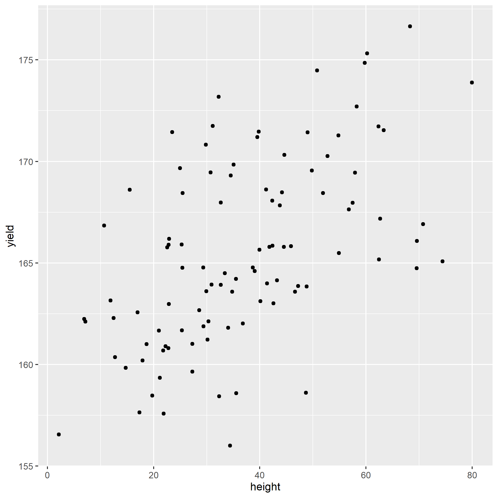

# Introduction

This exercise introduces exploratory analysis for
continuous variables using scatterplots and
correlation. You will visualize pairwise
relationships and quantify linear association.

# Case Study: Corn Allometry Data

*Allometry* studies how plant traits scale with one
another. In agronomy, it helps explain how biomass
allocation (leaves, stalks, height) relates to yield.

```{r}
library(tidyverse)
allometry = read.csv("data/corn_allometry.csv")

head(allometry)
```

## Scatterplot Matrix

```{r}
plot(allometry)
```

The scatterplot matrix is useful for screening many
variables quickly.

## Single Scatterplot with ggplot2

```{r}
allometry %>%
  ggplot(aes(x=total_leaves, y=yield)) +
  geom_point()
```

## Correlation Test

```{r}
cor.test(allometry$yield, allometry$total_leaves)
```

## Correlation Matrix

```{r}
cor(allometry)
```

# Practice 1

Using `allometry`, create a scatterplot with
`height` on the x-axis and `yield` on the y-axis.
Your plot should look like:

```{r}
p = allometry %>%
  ggplot(aes(x=height, y=yield)) +
  geom_point()

ggsave("images/yield_vs_height.png", device = "png")
```



# Practice 2

Using `allometry`, calculate the correlation between
`height` and `yield` using `cor.test()`. Your
correlation estimate should be close to `0.49`.

```{r}
cor.test(allometry$stalk_circ, allometry$yield)
```

# Practice 3

Load `data/corn_fertility.csv` and inspect it.

```{r}
fertility = read.csv("data/corn_fertility.csv")
head(fertility)
```

Create a scatterplot matrix for all variables in
`fertility`.

```{r}

```

# Practice 4

Create a correlation matrix for all variables in
`fertility`.

```{r}

```
