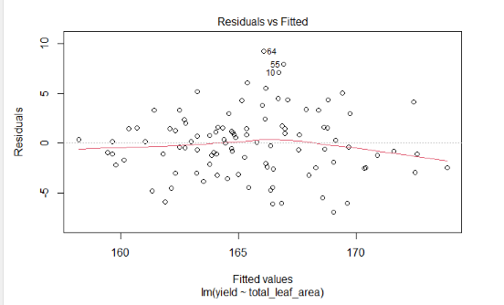
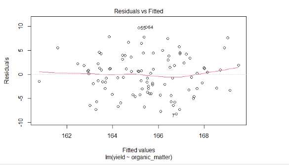

# Introduction

In this exercise, you will move from exploratory
association (correlation) to directional modeling
(regression). You will fit models, inspect
coefficients, evaluate residuals, and interpret
model fit.

# Case Study: Corn Allometry

```{r}
library(tidyverse)
allometry = read.csv("data/corn_allometry.csv")
head(allometry)
```

## Fit the Model

```{r}
model_yield_total_leaves = lm(yield ~ total_leaves, data=allometry)
```

## Examine Residuals

```{r}
plot(model_yield_total_leaves, which=1)
```

## Inspect Coefficients

```{r}
library(broom)
tidy(model_yield_total_leaves)
```

## Additional Model Fit Metrics

```{r}
anova(model_yield_total_leaves)
```

```{r}
glance(model_yield_total_leaves)
```

# Practice 1

Model `yield` as a function of `total_leaf_area`.

1. Fit the regression model.

```{r}

```

2. Plot residuals. Your output should resemble:



3. View model coefficients.

```{r}

```

4. Interpret significance and direction of the
relationship, and write the regression equation.

5. Use `glance()` to evaluate model fit.

```{r}

```

You should see `r.squared` near `0.50`.

# Practice 2

```{r}
fertility = read.csv("data/corn_fertility.csv")
head(fertility)
```

1. Create a simple linear regression model for
`yield` as a function of `organic_matter`.

```{r}

```

2. Plot residuals.

```{r}

```



3. Inspect coefficients and interpret direction,
significance, and regression equation.

```{r}
library(broom)

```

4. Use `glance()` to evaluate model fit.

```{r}

```

You should see `r.squared` near `0.15`.
