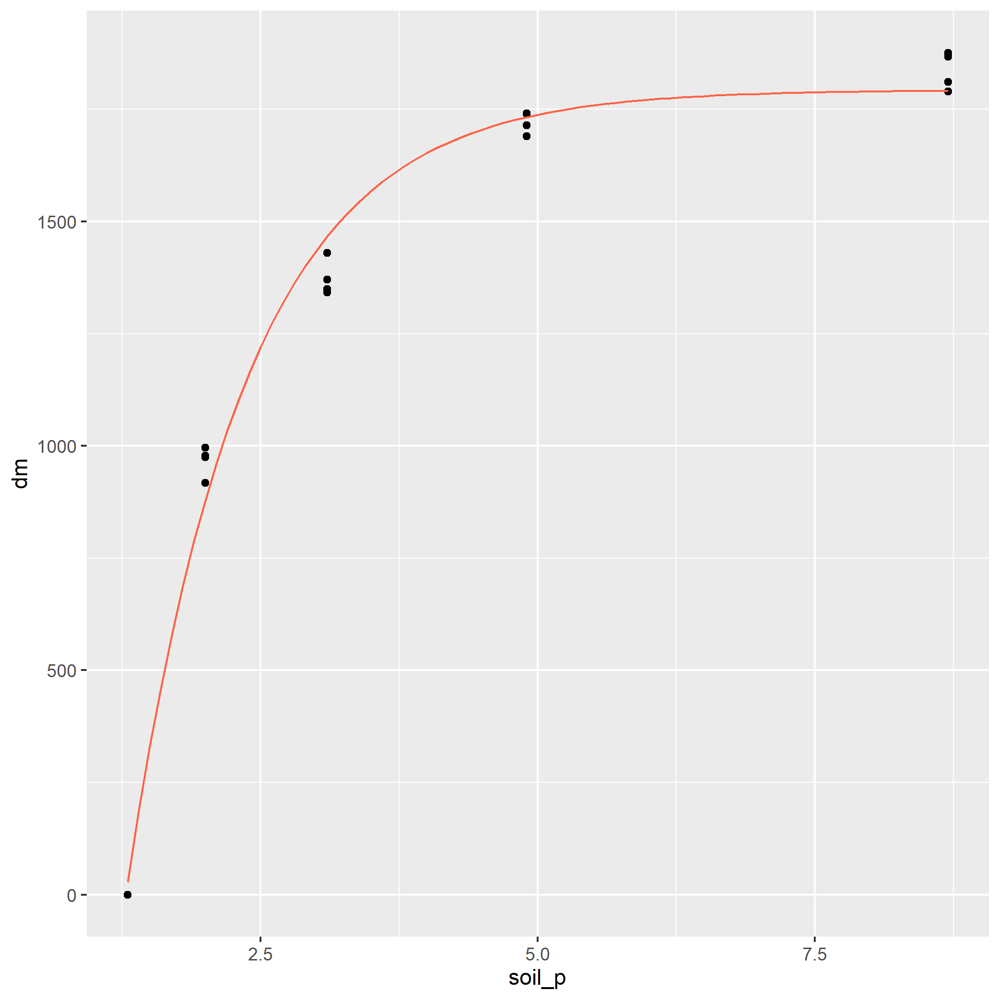
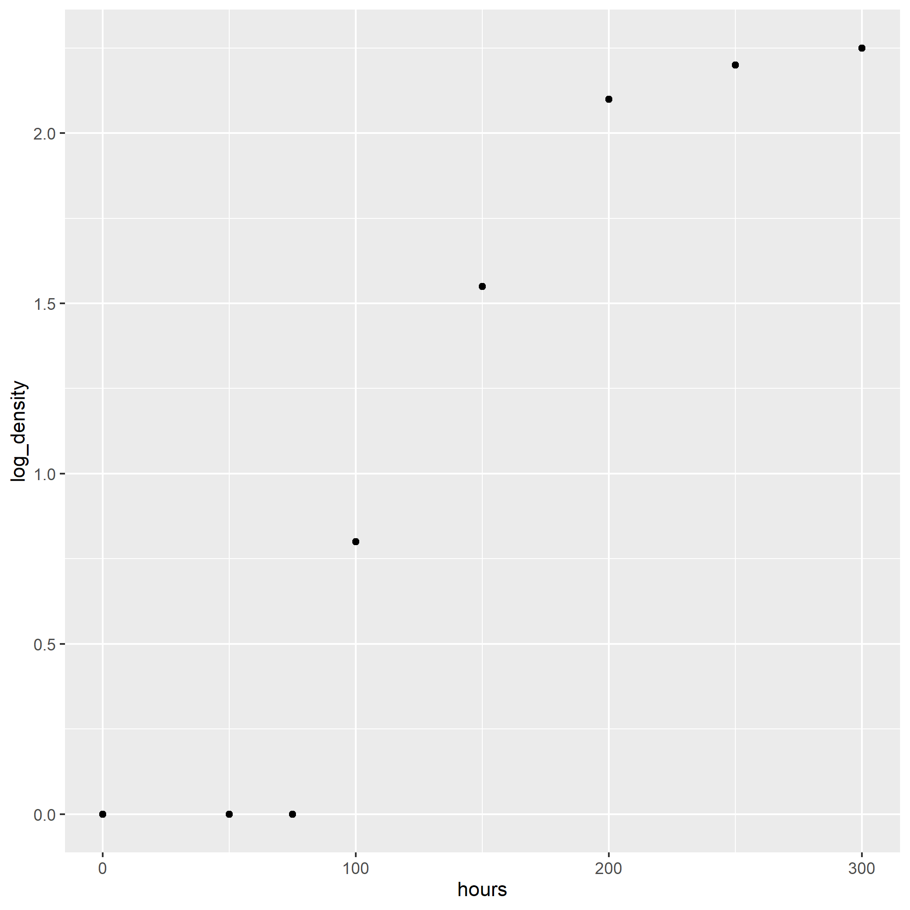

# Introduction

This exercise introduces nonlinear regression for
responses that are not well represented by a
straight line.

# Case Study 1: Monomolecular Model

```{r}
library(tidyverse)
silage = read.csv("data/corn_silage_pop_mono.csv")
head(silage)
```

```{r}
p = silage %>%
  ggplot(aes(x=population, y=yield)) +
  geom_point()

p
```

```{r}
silage_mono = stats::nls(yield ~ SSasymp(population,init,m,plateau), data=silage)

summary(silage_mono)
```

```{r}
silage_predicted = data.frame(
  population =
    seq(from=0,to=10.4,by=0.1)
  )

silage_predicted
```

```{r}
silage_predicted$yield = predict(silage_mono, silage_predicted)
```

```{r}
p +
  geom_line(data = silage_predicted, aes(x=population, y=yield), color="tomato")
```

# Case Study 2: Logistic Model

```{r}
velvetleaf = read.csv("data/velveleaf_gdd_lai_gomp.csv")
head(velvetleaf)
```

```{r}
pV = velvetleaf %>%
  ggplot(aes(x=gdd, y=la)) +
  geom_point()

pV
```

```{r}
velvetleaf_log = stats::nls(la ~ SSlogis(gdd, Asym, xmid, scal), data=velvetleaf)

summary(velvetleaf_log)
```

```{r}
velvetleaf_predicted = data.frame(
  gdd =
    seq(from=100,to=600,by=10)
  )

velvetleaf_predicted
```

```{r}
velvetleaf_predicted$la = predict(velvetleaf_log, velvetleaf_predicted)
```

```{r}
pV +
  geom_line(data = velvetleaf_predicted, aes(x=gdd, y=la), color="tomato")
```

# Practice 1

```{r}
ryegrass = read.csv("data/ryegrass_soil_p_mono.csv")
head(ryegrass)
```

1. Create a scatterplot of the original data and save
it as an object.

```{r}

```

2. Fit a monomolecular model and print `summary()`.
Target convergence tolerance is near `2.535e-06`.

```{r}

```

3. Create a dataset with `soil_p` from `1.3` to `8.7`
by `0.1`.

```{r}

```

4. Predict `dm` for each new `soil_p` value.

```{r}

```

5. Add the modeled curve to your initial plot.

```{r}

```



# Practice 2

```{r}
aspergillus = read.csv("data/aspergillus_hours_density_logist.csv")
head(aspergillus)
```

1. Plot the original data.

```{r}

```

2. Fit the logistic model.

```{r}

```

3. Create a new dataset with `hours` from `0` to
`300` in increments of `10`.

```{r}

```

4. Predict values for the logistic curve.

```{r}
aspergillus_predicted$log_density = predict(aspergillus_log, aspergillus_predicted)
```

5. Add the modeled curve to the initial plot.

```{r}

```


